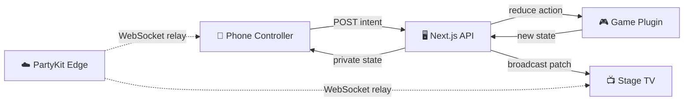

<div align="center">

# 🎲 The Merkive

**Browser party games for 2–12 friends — one shared Stage, everyone plays on their phone.**

[](LICENSE)
[](https://nextjs.org/)
[](https://partykit.io/)
[](https://typescriptlang.org/)
[](https://pnpm.io/)

[Getting Started](#-getting-started) · [Architecture](#-architecture) · [Add a Game](#-adding-a-new-game) · [Deploy](#-deployment) · [Contributing](#-contributing) · [License](#-license)

</div>

---

## 📖 Overview

The Merkive is an open-source, browser-based party game platform inspired by Jackbox-style gameplay. One device serves as the **Stage** (TV or laptop for everyone to watch), while each player joins on their **phone** as a **Controller** — no app downloads required. Rooms use simple 4-letter codes and games are modular plugins that snap into the platform with zero shell changes.

### 🎮 Launch Games

| Game | Players | Description |
| :--- | :---: | :--- |
| **Banterbolt** | 3–12 | Write outrageous answers to prompts, vote for the best, ZAP bonus for clean sweeps, and a Lightning Round finale |
| **Eightstorm** | 2–12 | Crazy-8s shedding — match rank or suit, eights are wild, house rules for stacks/skips/reverses |
| **Tile Tangle** | 2–12 | Rummikub-style sets & runs with full table rearrangement and a 30-point opening meld |
| **You got it? Good.** | 4–12 | The Oracle drops one clue, the team slides the dial to match it, the other team calls the Undercut |
| **Mr Merkissioner, Sir** | 5–12 | Hidden-role social deduction — pass decrees, sniff out the Merkites, never elect Mr Merkissioner as Commissioner |
| **Merkade** | 3–12 | A rotating arcade of three party-game modes on one scoreboard — bluff-the-truth trivia, secret-prompt pixel doodles, and majority-vote predictions |

### 📦 Upcoming Content Packs

| Pack | Status | Theme |
| :--- | :---: | :--- |
| **The Merkining** | ✅ Live | Core party pack (Banterbolt, Eightstorm, Tile Tangle, You got it? Good., Mr Merkissioner, Sir, Merkade) |
| **Merkaggeddon** | 🔜 Coming Soon | Competitive chaos pack |
| **Merky After Dark** | 🔜 Coming Soon | Adults-only party games |
| **Seen & Heard** | 🔜 Coming Soon | Social deduction & conversation |

---

## ⚡ Getting Started

### Prerequisites

- [Node.js](https://nodejs.org/) ≥ 18
- [pnpm](https://pnpm.io/) ≥ 10 (`corepack enable && corepack prepare pnpm@latest --activate`)

### Installation & Local Development

```bash
# Clone the repository
git clone https://github.com/Mster115/the-merkive.git
cd the-merkive

# Install dependencies
pnpm install

# Start the development server (Next.js web shell + PartyKit edge relay)
pnpm dev
```

### Playing Locally

| Screen | URL | Purpose |
| :--- | :--- | :--- |
| **Controller** | `http://localhost:3000` | Create or join a room from your phone/browser |
| **Stage** | `http://localhost:3000/stage/CODE` | Big-screen display for the group to watch |
| **Add Local Player** | Click **"+ Add a local player"** in the lobby | Test with multiple players in one browser |

### Environment Variables

Copy `.env.example` to `.env` and configure as needed:

```bash
cp .env.example .env
```

| Variable | Default | Description |
| :--- | :---: | :--- |
| `MB_MODE` | `memory` | Runtime mode (`memory` for dev, `partykit` for prod) |
| `NEXT_PUBLIC_MB_MODE` | `memory` | Client-side transport selection |
| `PARTYKIT_HOST` | — | PartyKit server host (production only) |
| `NEXT_PUBLIC_PARTYKIT_HOST` | — | Client-side PartyKit WebSocket host |
| `MB_SWEEP_SECRET` | — | Secret for the external sweeper endpoint |

---

## 🏗️ Architecture

```
merky-box/
├── apps/
│   └── web/                  # Next.js 15 App Router (Stage & Controller shell, API routes)
├── packages/
│   ├── game-sdk/             # Core plugin contract: GameModule, deterministic RNG, test harness
│   ├── games/                # Game plugins (Banterbolt, Eightstorm, Tile Tangle, You got it? Good., Mr Merkissioner, Sir, Merkade) + registry
│   ├── party/                # PartyKit Edge Room Engine (Durable Objects & WebSockets)
│   └── ui/                   # Neo-Brutalist Design System (@merky/ui tokens & components)
├── market-research/          # Competitive analysis & game design research
├── CONTRACTS.md              # Platform engineering contracts & state semantics
├── DESIGN.md                 # Visual design specification (colors, typography, motion)
└── CLAUDE.md                 # AI assistant working instructions
```

### How It Works



- **Server-authoritative**: Controllers POST intents to `/api/rooms/[code]/action`; the server executes the game's pure `reduce` function and updates room state. Private card hands and prompts never reach unauthorized clients.
- **PartyKit Edge Engine**: In production, state broadcasts and WebSockets run on Cloudflare's Edge via PartyKit. This eliminates database latency and delivers sub-30ms real-time patches. Zero database configuration required.
- **Deterministic state**: Each `reduce` call receives a seed derived from `(match seed, state version)`. Matches are 100% replayable from event logs.
- **Three state slots**: `publicState` (broadcast to all), per-seat `privateState` (only that player sees it), and `secretState` (server-only, never sent to any client).

---

## 🛠️ Adding a New Game

Games are fully self-contained plugins. Adding a new game requires **zero changes** to the web shell or API routes:

### 1. Create the Game Directory

```
packages/games/src/<game_id>/
├── index.tsx          # Export a GameModule via defineGame(...)
├── logic.ts           # Pure init(ctx) and reduce(ctx, state, action) functions
├── Stage.tsx          # TV display component (StageProps)
├── Controller.tsx     # Mobile phone controller component (ControllerProps)
└── __tests__/
    └── <game_id>.spec.ts  # Unit tests using @merky/game-sdk/testing
```

### 2. Register the Game

Add one line to `packages/games/src/index.ts`:

```ts
import { mygame } from "./mygame";

export const gameRegistry: Record<string, GameModule> = {
  // ...existing games...
  [mygame.meta.id]: mygame,
};
```

### 3. Run Tests

```bash
pnpm test
```

> [!TIP]
> The built-in registry test suite automatically enforces unique IDs, player bounds, i18n keys, and UI exports.

### Essential Reading for Game Authors

| Document | What It Covers |
| :--- | :--- |
| [Game SDK Guide](packages/game-sdk/README.md) | Full plugin contract: state slots, lifecycle, determinism, timers, bots, i18n, test harness |
| [CONTRACTS.md](CONTRACTS.md) | Platform state semantics, versioning CAS, room lifecycle, ownership zones |
| [DESIGN.md](DESIGN.md) | Neo-brutalist design system: color tokens, typography, borders, motion, accessibility |

---

## 🚀 Deployment

The Merkive deploys to **Vercel** (web app) + **PartyKit** (edge realtime relay).

### Step 1 — Deploy PartyKit Edge Relay

```bash
cd packages/party
npx partykit deploy
```

Note your deployed host (e.g., `the-merkive-party.username.partykit.dev`).

### Step 2 — Deploy to Vercel

Add these environment variables in your Vercel Project Settings:

| Variable | Value |
| :--- | :--- |
| `NEXT_PUBLIC_MB_MODE` | `partykit` |
| `NEXT_PUBLIC_PARTYKIT_HOST` | `the-merkive-party.username.partykit.dev` |
| `PARTYKIT_HOST` | `the-merkive-party.username.partykit.dev` |

Then deploy:

```bash
npx vercel --prod
```

---

## 🧪 Commands Reference

| Command | Description |
| :--- | :--- |
| `pnpm dev` | Run Next.js web app & PartyKit dev servers |
| `pnpm test` | Run unit & integration tests across all packages |
| `pnpm typecheck` | Strict TypeScript verification across all packages |
| `pnpm build` | Production build |
| `pnpm --filter @merky/games test` | Run game plugin tests only |
| `pnpm --filter @merky/web test` | Run platform tests only |

---

## 🤝 Contributing

Contributions are welcome! Please read **[CONTRIBUTING.md](CONTRIBUTING.md)** for the full guide covering setup, coding standards, commit conventions, and the PR process.

**Quick version:**

1. **Fork** the repository
2. **Create** a feature branch (`git checkout -b feature/my-new-game`)
3. **Read** the [Game SDK Guide](packages/game-sdk/README.md), [CONTRACTS.md](CONTRACTS.md), and [DESIGN.md](DESIGN.md)
4. **Implement** your changes following the plugin architecture
5. **Test** your changes (`pnpm test && pnpm typecheck`)
6. **Submit** a Pull Request

### Key Guidelines

- Game work happens inside `packages/games/src/<id>/` only — do not modify platform spine code
- Game logic must be **pure and deterministic** — no `Math.random()`, no `Date.now()`, no I/O
- All UI strings go through `t("games.<id>.*")` — no hardcoded English in JSX
- Use `@merky/ui` components and design tokens from [DESIGN.md](DESIGN.md)
- Stage must be readable at 10 ft; Controllers must work at 360px with ≥44px touch targets

> [!IMPORTANT]
> Never put hidden information in `publicState` — it is broadcast to every client. Use `privateState` for per-seat secrets and `secretState` for server-only data (decks, hidden targets, etc.).

---

## 🛡️ Tech Stack

| Technology | Purpose |
| :--- | :--- |
| [Next.js 15](https://nextjs.org/) | App Router, API routes, SSR |
| [PartyKit](https://partykit.io/) | Edge-native WebSocket relay (Cloudflare Durable Objects) |
| [React](https://react.dev/) | UI components |
| [TypeScript](https://typescriptlang.org/) | Strict mode + `noUncheckedIndexedAccess` |
| [Tailwind CSS](https://tailwindcss.com/) | Utility-first styling with custom neo-brutalist tokens |
| [Vitest](https://vitest.dev/) | Unit & integration testing |
| [pnpm](https://pnpm.io/) | Fast, disk-efficient package manager with workspace support |
| [Vercel](https://vercel.com/) | Production hosting & edge functions |

---

## 📄 License

This project is licensed under the **Apache License 2.0** — see the [LICENSE](LICENSE) file for details.

```
Copyright 2025 The Merkive Contributors

Licensed under the Apache License, Version 2.0 (the "License");
you may not use this file except in compliance with the License.
You may obtain a copy of the License at

    http://www.apache.org/licenses/LICENSE-2.0
```

---

<div align="center">

**Built with ❤️ for game night.**

</div>
